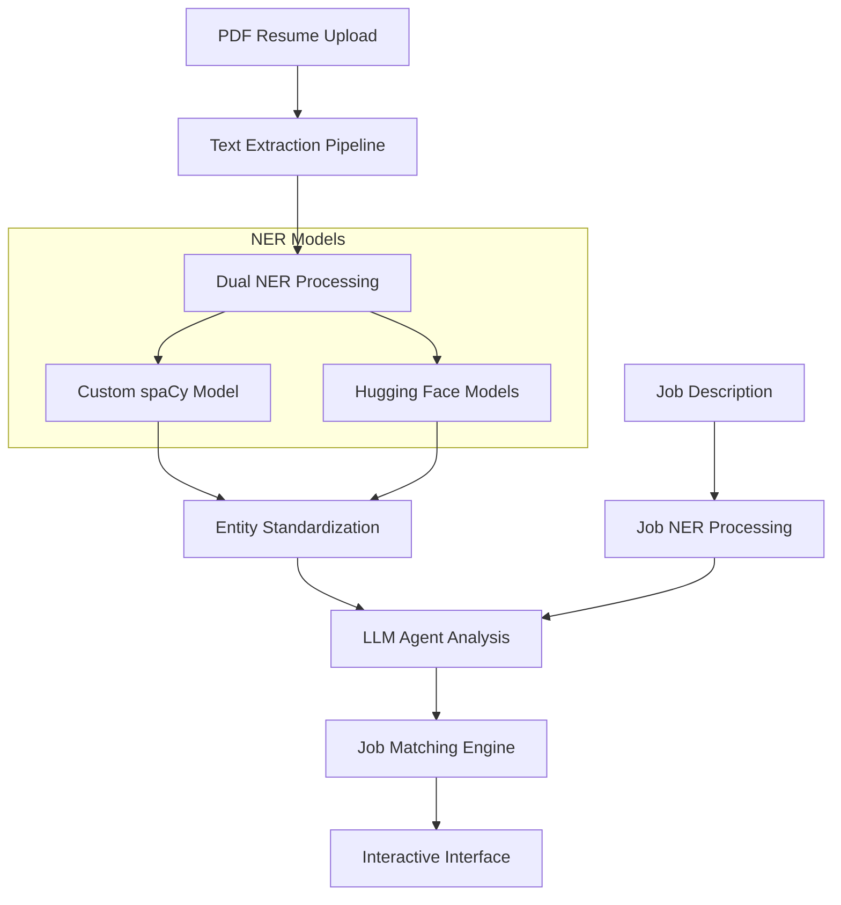
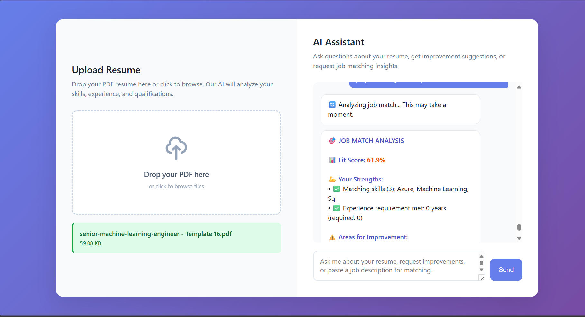
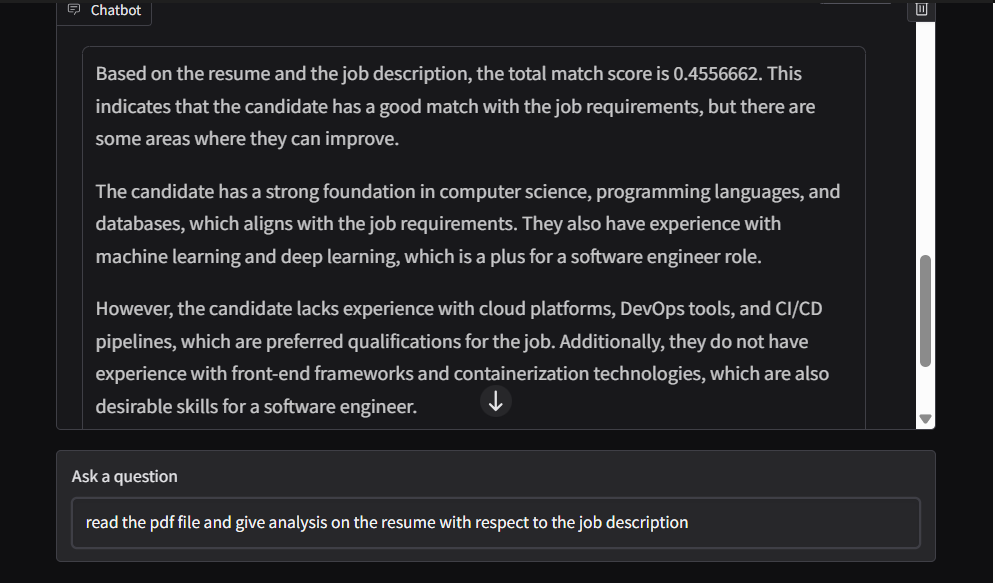
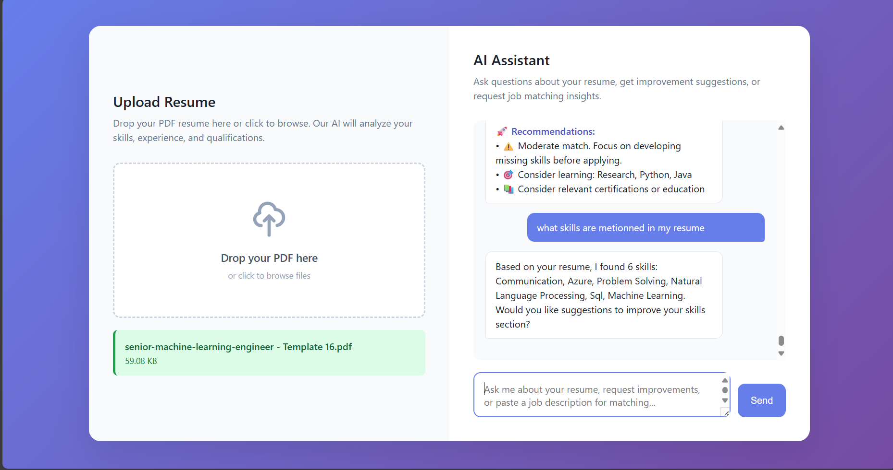
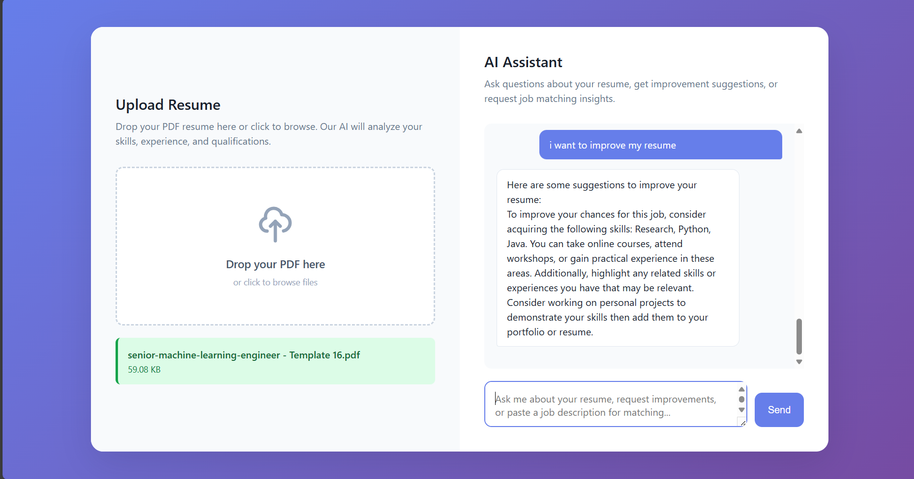

#  Resume Assistant - Resume–Job Matching System

A comprehensive AI-driven platform for resume analysis, job matching, and career optimization using cutting-edge NLP technologies, LLM agents, and interactive web interfaces.


##  Overview

The Resume Assistant is a sophisticated AI platform that revolutionizes how job seekers analyze their resumes and match them with job opportunities. It combines multiple state-of-the-art technologies to provide comprehensive career insights and optimization recommendations.

###  Key Capabilities

- **Advanced PDF Processing**: Multi-method text extraction from complex resume layouts
- **AI-Powered Parsing**: Dual NER approach using custom spaCy and Hugging Face models
- **Intelligent Job Matching**: Sophisticated scoring algorithms with semantic similarity
- **Interactive Chat Interface**: LLM-powered conversational analysis
- **Multiple Interfaces**: Web UI, command-line, and notebook environments
- **Comprehensive Analytics**: Detailed skills analysis and gap identification
- **Real-time Processing**: Fast inference with optimized model pipelines

---

##  Architecture

### Core Components



### Technology Stack

| Component | Technology | Purpose |
|-----------|------------|---------|
| **PDF Processing** | PyMuPDF, flitz | Multi-method text extraction |
| **NER Models** | spaCy, Transformers | Entity recognition & classification |
| **LLM Integration** | LangChain, LangGraph | Agent orchestration & reasoning |
| **LLM Providers** | Groq, Anthropic | Language model inference |
| **Web Interface** | Gradio | User interaction layers |
| **Matching Engine** | Scikit-learn, TF-IDF, encoder embeddings | Similarity calculations |


---

##  Quick Start

### Prerequisites

- **Python**: 3.8 or higher
- **API Keys**: 
  - Groq API key (recommended for speed)

### Installation

#### 1. Clone Repository
```bash
git clone https://github.com/YassineBen-Yahia/Resume-assistant.git
cd Resume-assistant
```


#### 2. Manual Setup
```bash
# Install dependencies
pip install -r requirements.txt

# Download spaCy model
python -m spacy download en_core_web_sm


```


### Running the Application

####  Web Interface (Recommended)
```bash
# Gradio notebook interface
jupyter notebook llm_integ.ipynb
```


##  AI Models & Processing

### Named Entity Recognition (NER)

#### 1. Custom spaCy Model (`model-best/`)
- **Training**: check this [repo](https://github.com/YassineBen-Yahia/CV-parsing)

#### 2. Hugging Face Models
- **Resume NER**: `manishiitg/resume-ner`
- **Job NER**: `Shrav20/job-ner-deberta`
- **Backup**: Generic NER models for fallback

### Advanced Semantic Similarity (`encoding_similarity.py`)

The system includes a sophisticated semantic similarity engine that goes beyond simple keyword matching using state-of-the-art sentence transformers.

#### Technology Stack
- **Model**: `sentence-transformers/all-MiniLM-L6-v2`
- **Framework**: Transformers + PyTorch
- **Method**: Mean pooling with L2 normalization
- **Similarity**: Cosine similarity in high-dimensional space

#### Key Features

1. **Dual Comparison Methods**:
   - **Skill-level**: Individual skill-to-skill comparison matrix
   - **Document-level**: Entire skill sets as semantic documents

2. **Advanced Text Encoding**:
   ```python
   def encode(texts):
       """Encode texts into high-dimensional embeddings"""
       # Tokenize with padding and truncation
       encoded_input = tokenizer(texts, padding=True, truncation=True, return_tensors='pt')
       
       # Generate contextual embeddings
       with torch.no_grad():
           model_output = model(**encoded_input)
       
       # Mean pooling for sentence-level representation
       embeddings = mean_pooling(model_output, encoded_input['attention_mask'])
       
       # L2 normalization for cosine similarity
       embeddings = torch.nn.functional.normalize(embeddings, p=2, dim=1)
       
       return embeddings.numpy()
   ```


#### Applications in Resume Analysis

1. **Skill Gap Analysis**: Identifies semantically related skills that candidates possess
2. **Education Matching**: Recognizes equivalent degrees across different naming conventions

### Large Language Models

#### Supported Providers
 **Groq** (Recommended)
   - Model: Llama 3.1 8B Instant
   - Speed: Ultra-fast inference


### Advanced Features

- **Skill Mapping**: Automatic related skill detection
- **Abbreviation Expansion**: "ML" → "Machine Learning"
- **Semantic Understanding**: Context-aware matching
- **Gap Analysis**: Detailed missing skill identification

---

##  Screenshots

<div align="center">

### Application Interface Showcase

| Upload & Processing | Analysis Results |
|:---:|:---:|
|  |  |

| Advices | Layout improvements |
|:---:|:---:|
|  |  |

</div>

##  Acknowledgments

### Technologies
- **[spaCy](https://spacy.io/)**: Industrial-strength NLP
- **[Hugging Face](https://huggingface.co/)**: Transformer models
- **[LangChain](https://langchain.com/)**: LLM application framework
- **[Groq](https://groq.com/)**: Ultra-fast inference
- **[Gradio](https://gradio.app/)**: Interactive interfaces
- **[Flask](https://flask.palletsprojects.com/)**: Web framework

### Models
- **Custom spaCy Model**: Trained on curated resume dataset
- **`manishiitg/resume-ner`**: Pre-trained resume NER model
- **`Shrav20/job-ner-deberta`**: Job description NER model


