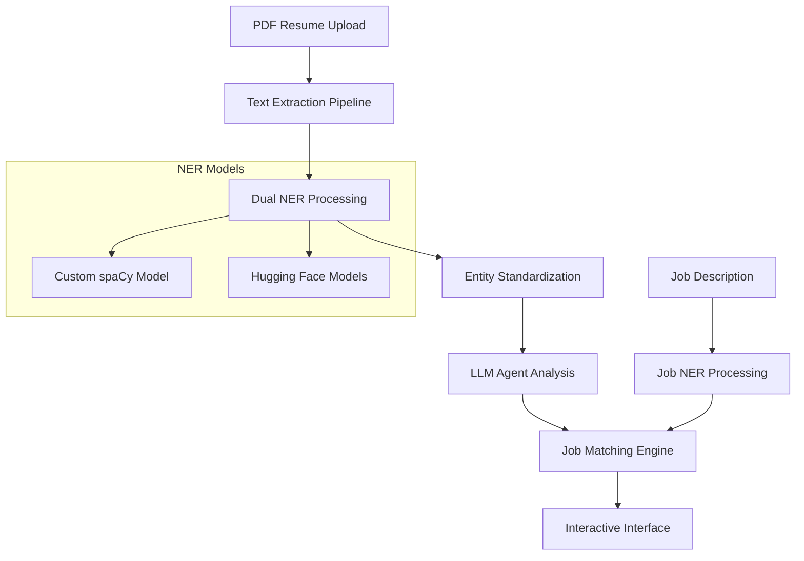

#  Resume Assistant - Advanced AI-Powered CV Analysis Platform

A comprehensive AI-driven platform for resume analysis, job matching, and career optimization using cutting-edge NLP technologies, LLM agents, and interactive web interfaces.


##  Overview

The Resume Assistant is a sophisticated AI platform that revolutionizes how job seekers analyze their resumes and match them with job opportunities. It combines multiple state-of-the-art technologies to provide comprehensive career insights and optimization recommendations.

###  Key Capabilities

- **Advanced PDF Processing**: Multi-method text extraction from complex resume layouts
- **AI-Powered Parsing**: Dual NER approach using custom spaCy and Hugging Face models
- **Intelligent Job Matching**: Sophisticated scoring algorithms with semantic similarity
- **Interactive Chat Interface**: LLM-powered conversational analysis
- **Multiple Interfaces**: Web UI, command-line, and notebook environments
- **Comprehensive Analytics**: Detailed skills analysis and gap identification
- **Real-time Processing**: Fast inference with optimized model pipelines

---

##  Architecture

### Core Components



### Technology Stack

| Component | Technology | Purpose |
|-----------|------------|---------|
| **PDF Processing** | PyMuPDF, flitz | Multi-method text extraction |
| **NER Models** | spaCy, Transformers | Entity recognition & classification |
| **LLM Integration** | LangChain, LangGraph | Agent orchestration & reasoning |
| **LLM Providers** | Groq, Anthropic | Language model inference |
| **Web Interface** | Gradio | User interaction layers |
| **Matching Engine** | Scikit-learn, TF-IDF, encoder embeddings | Similarity calculations |


---

## 🚀 Quick Start

### Prerequisites

- **Python**: 3.8 or higher
- **API Keys**: 
  - Groq API key (recommended for speed)

### Installation

#### 1. Clone Repository
```bash
git clone https://github.com/YassineBen-Yahia/Resume-assistant.git
cd Resume-assistant
```


#### 2. Manual Setup
```bash
# Install dependencies
pip install -r requirements.txt

# Download spaCy model
python -m spacy download en_core_web_sm


```


### Running the Application

####  Web Interface (Recommended)
```bash
# Gradio notebook interface
jupyter notebook llm_integ.ipynb
```


##  AI Models & Processing

### Named Entity Recognition (NER)

#### 1. Custom spaCy Model (`model-best/`)
- **Training**: check this [repo](https://github.com/YassineBen-Yahia/CV-parsing)

#### 2. Hugging Face Models
- **Resume NER**: `manishiitg/resume-ner`
- **Job NER**: `Shrav20/job-ner-deberta`
- **Backup**: Generic NER models for fallback

### Large Language Models

#### Supported Providers
 **Groq** (Recommended)
   - Model: Llama 3.1 8B Instant
   - Speed: Ultra-fast inference


##  Matching Algorithm

### Scoring Components

The job matching system uses a weighted approach:

#### 1. Skills Matching (50% weight)
```python
def skill_match_score(job_skills, candidate_skills):
    # Exact matches
    exact_matches = set(job_skills) & set(candidate_skills)
    exact_score = len(exact_matches) / len(job_skills)
    
    # Semantic similarity (TF-IDF + Cosine)
    semantic_score = cosine_similarity(
        tfidf_vectorizer.transform([' '.join(job_skills)]),
        tfidf_vectorizer.transform([' '.join(candidate_skills)])
    )
    
    return 0.9 * exact_score + 0.1 * semantic_score
```

#### 2. Education Matching (25% weight)
- Degree level comparison
- Field of study alignment
- Institution ranking (optional)

#### 3. Experience Matching (25% weight)
- Years of experience
- Role progression
- Industry relevance

### Advanced Features

- **Skill Mapping**: Automatic related skill detection
- **Abbreviation Expansion**: "ML" → "Machine Learning"
- **Semantic Understanding**: Context-aware matching
- **Gap Analysis**: Detailed missing skill identification

---

## Web Interfaces

### Gradio Notebook (`llm_integ.ipynb`)

```python
# Features:
- Jupyter integration
- Interactive widgets
- Live model testing
- Development environment
- Educational interface
```

---


## Project Structure

```
Resume-assistant/
│
├── 📁 Custom Utilities
│   ├── custom_utils/
│   │   ├── fit_calc.py        # Matching algorithms
│   │   ├── Process_data.py    # Data processing
│   │   ├── gradio_utils.py    # UI utilities
│   │   ├── tools.py           # LangChain tools
│   │   ├── utils.py           # Helper functions
│   │   └── regex_patterns.py  # Text patterns
│
├── 📁 Models & Data
│   ├── model-best/            # Custom spaCy NER model
│   ├── uploads/               # File upload directory
│   └── temp/                  # Temporary processing
│
├── 📁 Interface Templates
│   ├── templates/             # HTML templates
│   └── assets/               # Screenshots & docs
│
├── 📁 Configuration
│   ├── requirements.txt       # Python dependencies
│   ├── .env.template         # Environment variables          
│
└── 📁 Documentation
    ├── README.md             # This file
    ├── llm_integ.ipynb      # Interactive notebook
    └── notebooks/           # Analysis notebooks
```


## 🙏 Acknowledgments

### Technologies
- **[spaCy](https://spacy.io/)**: Industrial-strength NLP
- **[Hugging Face](https://huggingface.co/)**: Transformer models
- **[LangChain](https://langchain.com/)**: LLM application framework
- **[Groq](https://groq.com/)**: Ultra-fast inference
- **[Gradio](https://gradio.app/)**: Interactive interfaces
- **[Flask](https://flask.palletsprojects.com/)**: Web framework

### Models
- **Custom spaCy Model**: Trained on curated resume dataset
- **`manishiitg/resume-ner`**: Pre-trained resume NER model
- **`Shrav20/job-ner-deberta`**: Job description NER model
